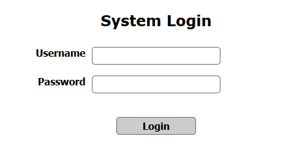
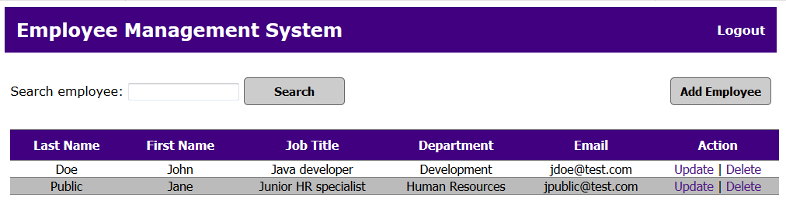

# employee-app
<b>Employee management web application</b>
  
<b>Description:</b>

An employee management web application that uses an HTTP server and an SQL database,
performing CRUD operations.
  
<b>Technologies used:</b>
 
<ol>
	<li>MVC design pattern</li>
	<li>JSP</li>
	<li>Servlet</li>
	<li>JDBC</li>
	<li>Apache Tomcat</li>
	<li>MySQL database</li>
</ol>

  

	
	  
	<b>Picture 1 - Login screen</b>

  

	
	  
	<b>Picture 2 - List employees</b>

  

	
	  
	<b>Picture 3 - Add employee</b>

  

	
	  
	<b>Picture 4 - Update employee</b>

  

	
	  
	

		<b>Picture 5 - Delete employee</b>
	
	

